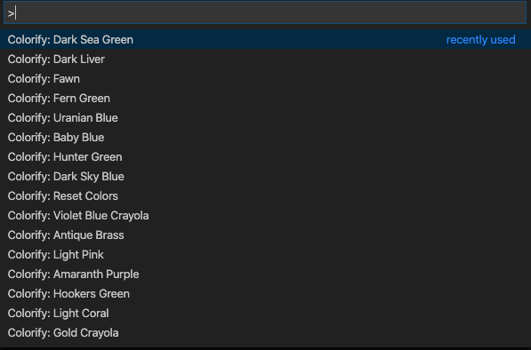
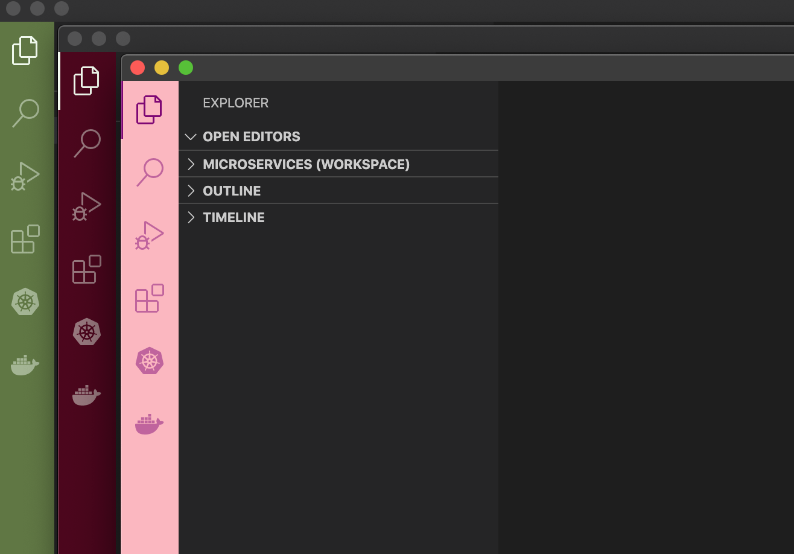

# Colorify

It is a very simple plugin which helps you change colors of the sidebar in Visual Studio Code. It has a pre-defined set of color palette so it is easy on the eyes.

Note: It will work only on workspaces.

## How to use

Open Command Palette and search for "Colorify". You should be able to see different colors:

Pick the one you like. Enjoy!

## How to reset color to default

From the command palette select `Colorify: Reset Colors`
